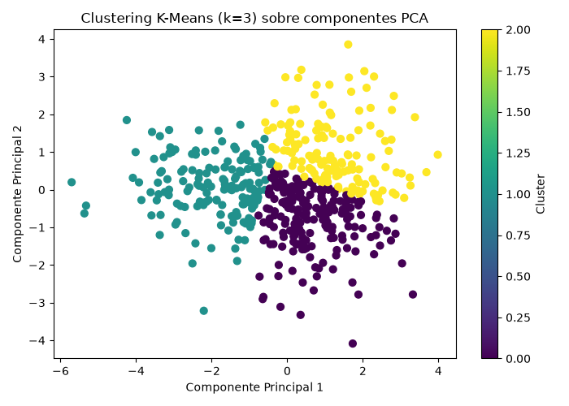

# Examen de Inteligencia Artificial 2026-2

Pipeline modular en Python que genera un dataset sintético, aplica
preprocesamiento, entrena un modelo de clasificación supervisada y
realiza un agrupamiento no supervisado con visualización en 2D.

## 1. Arquitectura del Proyecto

```
lab-evaluacion/
├── data/
│   ├── dataset.csv          # Dataset sintético generado
│   └── clustering_pca.png   # Visualización 2D del clustering
├── src/
│   ├── data_loader.py       # Generación y carga del dataset
│   ├── preprocessing.py     # Split Train/Test + escalado con StandardScaler
│   ├── supervised_model.py  # Clasificador (Entrenamiento y Evaluación)
│   └── unsupervised_model.py# PCA + K-Means + Silueta
├── main.py                  # Orquestador principal del pipeline
├── .gitignore
└── README.md                # Este informe
```

**Descripción de cada módulo:**

- **`src/data_loader.py`**: genera un dataset sintético de clasificación
  binaria con `make_classification` (4 características continuas + 1
  variable objetivo), y lo guarda/carga desde `data/dataset.csv`.
- **`src/preprocessing.py`**: separa features/target, divide los datos
  en Train/Test (80/20) y aplica `StandardScaler`, ajustándolo
  **únicamente** sobre el conjunto de entrenamiento para evitar fuga
  de información (*data leakage*) hacia el conjunto de prueba.
- **`src/supervised_model.py`**: entrena un clasificador de
  **Regresión Logística** sobre los datos escalados y reporta
  Accuracy, F1-score y Matriz de Confusión.
- **`src/unsupervised_model.py`**: aplica **PCA** (4 → 2 componentes),
  luego **K-Means (k=3)** sobre esas 2 componentes, calcula el
  **Coeficiente de Silueta** y la **varianza explicada acumulada**, y
  genera una visualización 2D de los clusters.
- **`main.py`**: orquesta la ejecución completa del pipeline en orden.

## 2. Cómo ejecutar el proyecto

```bash
python -m venv venv
.\venv\Scripts\Activate.ps1        # Windows
pip install scikit-learn pandas matplotlib numpy
python main.py
```

## 3. Resultados obtenidos

### Pipeline Supervisado (Regresión Logística)

```
Accuracy : 0.9700
F1-score : 0.9691
Matriz de Confusión:
[[50  0]
 [ 3 47]]

              precision    recall  f1-score   support
           0       0.94      1.00      0.97        50
           1       1.00      0.94      0.97        50
    accuracy                           0.97       100
   macro avg       0.97      0.97      0.97       100
weighted avg       0.97      0.97      0.97       100
```

### Pipeline No Supervisado (PCA + K-Means)

```
Varianza explicada acumulada (2 componentes): 0.8903
Coeficiente de Silueta (Silhouette Score): 0.3457
```

Visualización 2D del clustering (`data/clustering_pca.png`):



> *Nota: estas métricas provienen de una ejecución real de `main.py`.
> Si vuelves a ejecutarlo pueden variar levemente según la semilla
> aleatoria del dataset generado.*

## 4. Respuestas a las preguntas de control

*Las 3 preguntas de control serán proporcionadas por el docente al
final del examen. Esta sección se completará con las respuestas en
cuanto sean entregadas.*

1. 
2. 
3.
